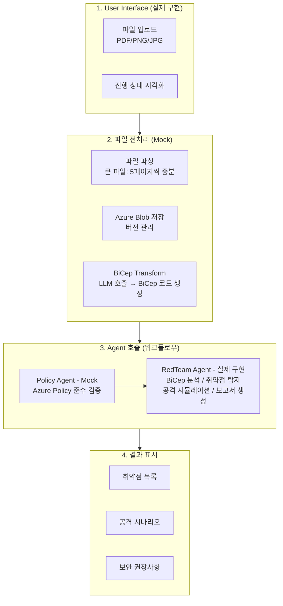
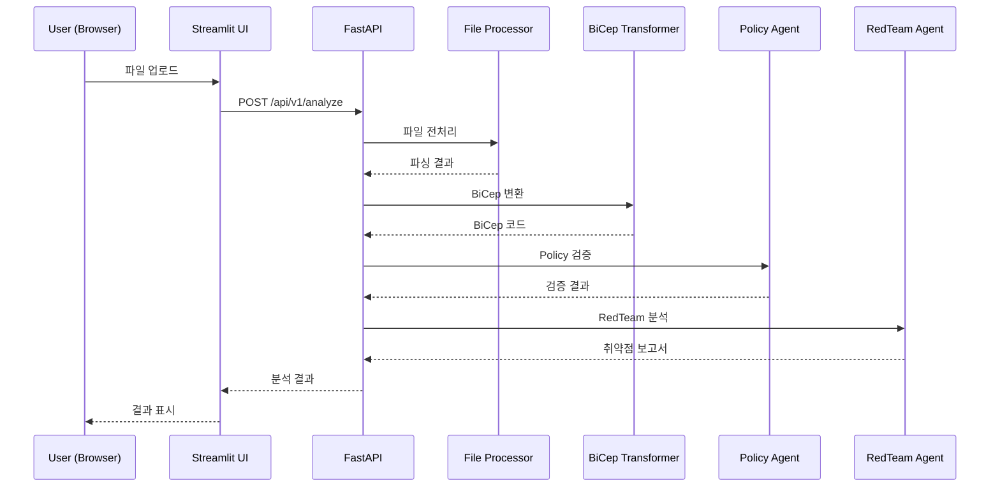

# 아키텍처 설계

## 구현 범위

### 실제 구현

1. **User Interface (Streamlit)** - 전체 구현
2. **RedTeam Agent** - 전체 구현
3. **API Layer (FastAPI + Gunicorn)** - 전체 구현

### Mock 구현 (추후 실제 전환)

- 파일 전처리 (파싱, BiCep Transform)
- Policy Agent
- Azure Blob Storage 연동
- 워크플로우 오케스트레이터

---

## 전체 파이프라인 흐름

---

## 컴포넌트 상세

### 1. User Interface

**기능 명세:**

1. **파일 업로드** - 지원 포맷: PDF, PNG, JPG
2. **파이프라인 시각화** - 파일 업로드 → 전처리 → BiCep 변환 → Policy 검증 → RedTeam 분석
3. **결과 표시** - RedTeam 보고서 렌더링, 취약점 목록, 보안 권장사항

### 2. RedTeam Agent

**핵심 기능:**

1. **BiCep 코드 분석** - 리소스 구성 이해 및 관계 분석
2. **취약점 탐지** - 보안 설정 오류, 네트워크 노출 위험, 인증/인가 검증, 암호화 누락
3. **공격 시뮬레이션** - 잠재적 공격 벡터 도출, 취약점 악용 시나리오 작성
4. **보고서 생성** - 심각도별 취약점 분류, 공격 시뮬레이션 결과, 보안 개선 권장사항 (마크다운)

### 3. API Layer

**핵심 기능:**

1. **파일 업로드 엔드포인트** - 파일 검증 (크기 20MB, 포맷), 비동기 처리
2. **오케스트레이션** - 전처리 → Policy Agent → RedTeam Agent 순차 호출 및 결과 통합
3. **상태 관리** - `GET /api/v1/status/{task_id}` 진행 상태 조회
4. **에러 핸들링** - 표준화된 에러 응답 및 로깅

---

## API 호출 시퀀스

---

## Mock 서비스 명세

Mock 서비스는 실제 구현 전환 전까지 정적 샘플 데이터를 반환합니다.

| 서비스             | 현재 동작                           | 실제 구현 시                             |
| ------------------ | ----------------------------------- | ---------------------------------------- |
| 파일 전처리        | 샘플 BiCep 코드 반환                | 파일 파싱 (5p 증분), Azure Blob 저장     |
| BiCep Transform    | 샘플 BiCep 코드 반환                | LLM 호출하여 아키텍처 → BiCep 변환       |
| Policy Agent       | 패턴 기반 정적 검증                 | MS Agent Framework + Azure Policy 연동   |
| Blob Storage       | 인메모리 딕셔너리 저장              | Azure Blob Storage 연동                  |
