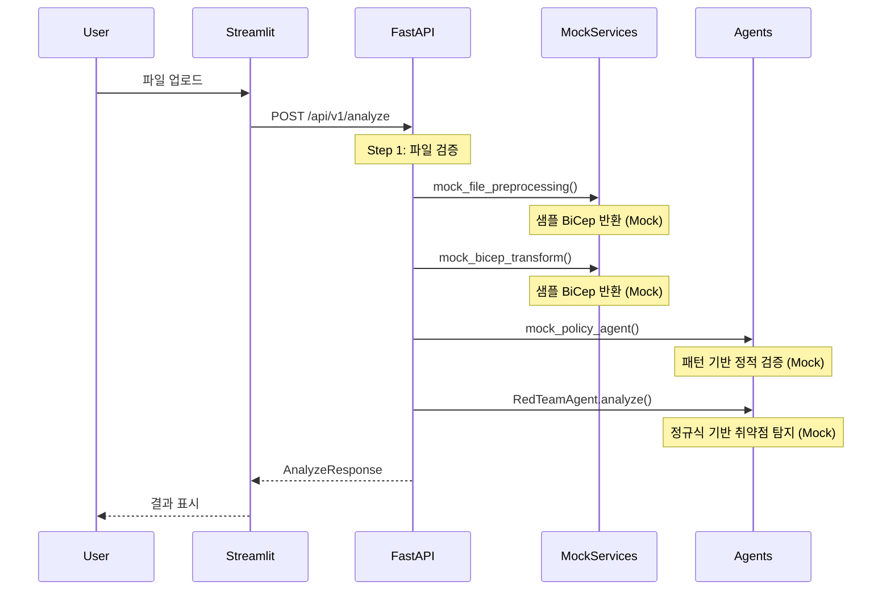

# 에이전트 워크플로우 분석

## 현재 구현 상태

### Microsoft Agent Framework (Semantic Kernel) 사용 여부: ❌ 미사용

현재 코드에서 Microsoft Agent Framework (Semantic Kernel)은 **Mock으로만 구현**되어 있습니다:

- `requirements.txt`에 `semantic-kernel`이 **없음**
- `RedTeamAgent`는 정적 규칙(정규식) 기반의 Mock 구현
- `mock_policy_agent`도 단순 패턴 매칭 Mock

---

## 현재 워크플로우 흐름



---

## 코드 흐름 상세

| 단계 | 파일 | 함수/클래스 | 설명 |
|------|------|-------------|------|
| 1 | `api/routers/analyze.py` | `analyze_architecture()` | 진입점 - 파일 검증 |
| 2 | `mock_services/file_processor.py` | `mock_file_preprocessing()` | Mock - 샘플 BiCep 반환 |
| 3 | `mock_services/bicep_transformer.py` | `mock_bicep_transform()` | Mock - 샘플 BiCep 반환 |
| 4 | `agents/mock_agents.py` | `mock_policy_agent()` | Mock - 패턴 기반 정책 검증 |
| 5 | `agents/redteam_agent.py` | `RedTeamAgent.analyze()` | Mock - 정규식 기반 취약점 탐지 |

---

## 실제 Microsoft Agent Framework 전환 시 필요한 작업

### 1. 의존성 설치

```bash
pip install semantic-kernel openai github-copilot-sdk
```

### 2. 환경 변수 설정 (택 1)

```bash
# GitHub Models (GitHub Copilot SDK)
export GITHUB_TOKEN="ghp_..."
export GITHUB_MODEL_ID="gpt-4o"

# Azure OpenAI
export AZURE_OPENAI_API_KEY="..."
export AZURE_OPENAI_ENDPOINT="https://{resource}.openai.azure.com/"

# OpenAI
export OPENAI_API_KEY="sk-..."
```

### 3. 전환 대상 컴포넌트

| 컴포넌트 | 현재 구현 | 전환 후 |
|----------|-----------|---------|
| RedTeam Agent | 정규식 기반 정적 분석 | Semantic Kernel + LLM 기반 동적 분석 |
| Policy Agent | 패턴 매칭 Mock | MS Agent Framework + Azure Policy 연동 |
| BiCep Transform | 샘플 코드 반환 | LLM 호출하여 아키텍처 → BiCep 변환 |
| File Processor | 샘플 코드 반환 | 실제 파일 파싱 + Azure Blob 저장 |

---

## 참고

- 현재 코드 주석에 명시: *"추후 Microsoft Agent Framework (Semantic Kernel) + GitHub Copilot SDK로 교체 예정"*
- 상세 전환 가이드: [DEVELOPMENT.md](DEVELOPMENT.md) 참조
