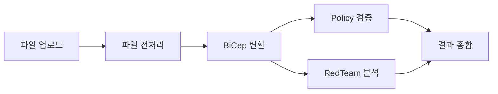

# API 명세

SecurityBlueprint Agent의 RESTful API 문서입니다.

## 기본 정보

- **Base URL**: `http://localhost:8000`
- **API Version**: `v1`
- **Content-Type**: `application/json` (파일 업로드 시 `multipart/form-data`)
- **OpenAPI 문서**: `http://localhost:8000/docs` (Swagger UI)
- **ReDoc**: `http://localhost:8000/redoc`

---

## 엔드포인트 목록

| Method | Endpoint             | 설명                           | 인증 |
| ------ | -------------------- | ------------------------------ | ---- |
| GET    | `/api/v1/health`     | 헬스 체크                      | 불필요 |
| POST   | `/api/v1/analyze`    | 아키텍처 파일 분석             | 불필요 |
| POST   | `/api/v1/chat`       | 보안 분석 결과 기반 챗봇       | 불필요 |
| POST   | `/api/v1/copilot`    | GitHub Copilot SDK 테스트      | 불필요 |

---

## 1. 헬스 체크

시스템 상태를 확인합니다.

### Request

```http
GET /api/v1/health
```

### Response

**200 OK**

```json
{
  "status": "healthy"
}
```

### Example

```bash
curl http://localhost:8000/api/v1/health
```

---

## 2. 아키텍처 파일 분석

아키텍처 다이어그램 파일을 업로드하여 보안 분석을 수행합니다.

### Request

```http
POST /api/v1/analyze
Content-Type: multipart/form-data
```

**Parameters**

| Name        | Type    | Required | Description                                  |
| ----------- | ------- | -------- | -------------------------------------------- |
| file        | File    | ✅       | 아키텍처 다이어그램 파일 (PDF, PNG, JPG)     |
| skip_policy | boolean | ❌       | Policy 검증 건너뛰기 (기본값: false)         |

**파일 제약사항**
- 지원 포맷: `.pdf`, `.png`, `.jpg`, `.jpeg`
- 최대 파일 크기: 20MB

### Response

**200 OK**

```json
{
  "status": "success",
  "task_id": "a1b2c3d4e5f6",
  "steps": [
    {
      "step": "파일 업로드",
      "status": "completed",
      "message": "architecture.png (2048576 bytes)"
    },
    {
      "step": "파일 전처리",
      "status": "completed",
      "message": null
    },
    {
      "step": "BiCep 변환",
      "status": "completed",
      "message": "1024 chars"
    },
    {
      "step": "Policy 검증",
      "status": "completed",
      "message": "정책 검증 완료: 위반 2건"
    },
    {
      "step": "RedTeam 분석",
      "status": "completed",
      "message": "취약점 5개"
    },
    {
      "step": "결과 종합",
      "status": "completed",
      "message": "취약점 5개 · 공격 3개"
    }
  ],
  "policy": {
    "status": "failed",
    "violations": [
      {
        "rule": "NSG-001",
        "severity": "high",
        "message": "Network Security Group이 0.0.0.0/0 (전체 인터넷)에서의 접근을 허용합니다.",
        "recommendation": "소스 IP 범위를 필요한 최소 범위로 제한하세요."
      }
    ],
    "recommendations": [
      {
        "rule": "NSG-002",
        "severity": "medium",
        "message": "SSH 포트(22)가 공개적으로 노출되어 있습니다.",
        "recommendation": "SSH 접근을 특정 IP 또는 VPN을 통해서만 허용하도록 설정하세요."
      }
    ],
    "summary": "정책 검증 완료: 위반 2건"
  },
  "security": {
    "vulnerabilities": [
      {
        "id": "VULN-001",
        "severity": "Critical",
        "category": "Network Security",
        "affected_resource": "myVirtualNetwork/mySubnet/myNSG",
        "title": "공개된 관리 포트",
        "description": "SSH 포트(22)가 인터넷에 공개되어 무차별 대입 공격에 취약합니다.",
        "evidence": "securityRules에서 sourceAddressPrefix: '*', destinationPortRange: '22' 확인됨",
        "remediation": "NSG 규칙을 수정하여 SSH 접근을 신뢰할 수 있는 IP 범위로만 제한하세요.",
        "benchmark_ref": "CIS Azure Foundations Benchmark v1.5.0 - 6.2"
      }
    ],
    "attack_scenarios": [
      {
        "id": "ATK-001",
        "name": "SSH 무차별 대입 공격",
        "mitre_technique": "T1110.001 - Brute Force: Password Guessing",
        "target_vulnerabilities": ["VULN-001"],
        "severity": "High",
        "prerequisites": "공개된 SSH 포트 (22번)",
        "attack_chain": [
          "공격자가 공개된 IP의 22번 포트를 스캔하여 SSH 서비스 탐지",
          "자동화 도구(Hydra, Medusa 등)를 사용해 무차별 대입 공격 수행",
          "약한 비밀번호 또는 기본 자격 증명으로 인증 성공",
          "VM에 대한 전체 접근 권한 획득"
        ],
        "expected_impact": "VM 탈취, 데이터 유출, 랜섬웨어 배포, 내부 네트워크 피봇 포인트 확보",
        "detection_difficulty": "Medium",
        "likelihood": "High"
      }
    ],
    "vulnerability_summary": {
      "Critical": 2,
      "High": 2,
      "Medium": 1,
      "Low": 0
    },
    "report": "# Azure 아키텍처 보안 분석 보고서\n\n## 요약\n\n전체 5개의 보안 취약점이 발견되었습니다..."
  }
}
```

**400 Bad Request** - 파일 검증 실패

```json
{
  "detail": "지원하지 않는 파일 형식: .txt. 지원: .pdf, .png, .jpg, .jpeg"
}
```

**400 Bad Request** - 파일 크기 초과

```json
{
  "detail": "파일 크기 초과: 25000000 bytes (최대 20971520 bytes)"
}
```

**200 OK** - 분석 중 오류 발생

```json
{
  "status": "error",
  "task_id": "a1b2c3d4e5f6",
  "steps": [
    {
      "step": "파일 업로드",
      "status": "completed",
      "message": "test.png (1024 bytes)"
    },
    {
      "step": "오류",
      "status": "error",
      "message": "Internal processing error"
    }
  ],
  "error": "Internal processing error"
}
```

### Example

```bash
# 기본 분석 (Policy 검증 포함)
curl -X POST http://localhost:8000/api/v1/analyze \
  -F "file=@architecture.png"

# Policy 검증 건너뛰기
curl -X POST http://localhost:8000/api/v1/analyze \
  -F "file=@architecture.pdf" \
  -F "skip_policy=true"
```

### 분석 파이프라인



1. **파일 업로드**: 파일 검증 (형식, 크기)
2. **파일 전처리**: 파일 파싱 (현재 Mock 구현)
3. **BiCep 변환**: 아키텍처 → BiCep 코드 변환 (현재 Mock 구현)
4. **Policy 검증** (병렬): Azure Policy 준수 검증 (현재 Mock 구현)
5. **RedTeam 분석** (병렬): 취약점 탐지 및 공격 시뮬레이션 (현재 Mock 구현)
6. **결과 종합**: 전체 결과 집계

---

## 3. 보안 분석 챗봇

분석 결과를 컨텍스트로 사용자 질문에 답변합니다.

### Request

```http
POST /api/v1/chat
Content-Type: application/json
```

**Body**

```json
{
  "question": "Critical 취약점의 수정 우선순위는?",
  "context": {
    "security": {
      "vulnerabilities": [...],
      "attack_scenarios": [...],
      "vulnerability_summary": {...},
      "report": "..."
    },
    "policy": {
      "status": "failed",
      "violations": [...],
      "recommendations": [...]
    }
  },
  "history": [
    {
      "role": "user",
      "content": "가장 심각한 취약점은 무엇인가요?"
    },
    {
      "role": "assistant",
      "content": "가장 심각한 취약점은 VULN-001입니다..."
    }
  ],
  "model": "gpt-4.1"
}
```

**Parameters**

| Name     | Type   | Required | Description                                  |
| -------- | ------ | -------- | -------------------------------------------- |
| question | string | ✅       | 사용자 질문                                   |
| context  | object | ❌       | 분석 결과 컨텍스트 (기본값: 빈 객체)          |
| history  | array  | ❌       | 이전 대화 내역 (기본값: 빈 배열)              |
| model    | string | ❌       | 사용할 LLM 모델 (기본값: "gpt-4.1")          |

### Response

**200 OK**

```json
{
  "status": "success",
  "answer": "Critical 취약점의 수정 우선순위는 다음과 같습니다:\n\n1. **VULN-001: 공개된 관리 포트**\n   - SSH 포트가 인터넷에 노출되어 있어 무차별 대입 공격에 매우 취약합니다.\n   - 즉시 NSG 규칙을 수정하여 신뢰할 수 있는 IP로만 제한해야 합니다.\n\n2. **VULN-002: ...**"
}
```

**500 Internal Server Error** - LLM API 호출 실패

```json
{
  "detail": "GitHub Copilot API connection failed"
}
```

### Example

```bash
curl -X POST http://localhost:8000/api/v1/chat \
  -H "Content-Type: application/json" \
  -d '{
    "question": "Critical 취약점을 어떻게 수정하나요?",
    "context": {
      "security": {
        "vulnerabilities": [
          {
            "id": "VULN-001",
            "severity": "Critical",
            "title": "공개된 관리 포트"
          }
        ]
      }
    }
  }'
```

### LLM 통합

- **LLM SDK**: GitHub Copilot SDK
- **기본 모델**: `gpt-4.1`
- **환경 변수**: `GITHUB_TOKEN` 필요
- **프롬프트 구성**:
  - 시스템 역할: "Azure 클라우드 보안 분석 전문가"
  - 컨텍스트: 취약점 목록, 공격 시나리오, Policy 검증 결과, 보안 보고서
  - 대화 히스토리: 최근 6개 메시지
- **타임아웃**: 120초

### 프롬프트 구조

```
당신은 Azure 클라우드 보안 분석 전문가입니다.
아래는 자동 보안 분석 결과입니다. 이 데이터를 근거로 사용자 질문에 한국어로 전문적이고 구체적으로 답변하세요.

## 취약점 목록
- [Critical] VULN-001: 공개된 관리 포트 (영향 리소스: myVirtualNetwork/mySubnet/myNSG) — SSH 포트(22)가 인터넷에 공개되어 무차별 대입 공격에 취약합니다. | 수정 방법: NSG 규칙을 수정하여 SSH 접근을 신뢰할 수 있는 IP 범위로만 제한하세요.

## 공격 시나리오
- [High] ATK-001: SSH 무차별 대입 공격 (MITRE: T1110.001 - Brute Force: Password Guessing) | 체인: 공격자가 공개된 IP의 22번 포트를 스캔하여 SSH 서비스 탐지 → 자동화 도구(Hydra, Medusa 등)를 사용해 무차별 대입 공격 수행 → ... | 예상 피해: VM 탈취, 데이터 유출, ...

## Policy 검증 결과
상태: failed
- 위반 [NSG-001] HIGH: Network Security Group이 0.0.0.0/0 (전체 인터넷)에서의 접근을 허용합니다. — 소스 IP 범위를 필요한 최소 범위로 제한하세요.

## 보안 보고서 (요약)
[보고서 내용 최대 3000자]

## 이전 대화
[최근 6개 메시지]

## 현재 질문
Critical 취약점의 수정 우선순위는?
```

---

## 4. GitHub Copilot SDK 테스트

GitHub Copilot SDK 연동 테스트용 엔드포인트입니다.

### Request

```http
POST /api/v1/copilot
Content-Type: application/json
```

**Body**

```json
{
  "prompt": "What is 2 + 2?",
  "model": "gpt-4.1",
  "timeout": 120.0
}
```

**Parameters**

| Name    | Type   | Required | Description                                  |
| ------- | ------ | -------- | -------------------------------------------- |
| prompt  | string | ❌       | Copilot에 보낼 프롬프트 (기본값: "What is 2 + 2?") |
| model   | string | ❌       | 사용할 모델 (기본값: "gpt-4.1")               |
| timeout | float  | ❌       | 응답 대기 타임아웃(초) (기본값: 120.0)        |

### Response

**200 OK**

```json
{
  "status": "success",
  "prompt": "What is 2 + 2?",
  "model": "gpt-4.1",
  "content": "2 + 2 equals 4."
}
```

**500 Internal Server Error** - Copilot SDK 호출 실패

```json
{
  "detail": "GitHub token not found"
}
```

### Example

```bash
curl -X POST http://localhost:8000/api/v1/copilot \
  -H "Content-Type: application/json" \
  -d '{
    "prompt": "Explain Azure NSG rules in Korean",
    "model": "gpt-4.1"
  }'
```

### 환경 설정

GitHub Copilot SDK를 사용하려면 환경 변수를 설정해야 합니다:

```bash
export GITHUB_TOKEN="ghp_your_token_here"
```

---

## 에러 처리

모든 엔드포인트는 다음과 같은 에러 응답 형식을 따릅니다:

### HTTP 상태 코드

| 코드 | 설명                                  |
| ---- | ------------------------------------- |
| 200  | 성공 (분석 실패 시에도 200 + status: error) |
| 400  | 잘못된 요청 (파일 검증 실패 등)       |
| 422  | 유효하지 않은 요청 본문               |
| 500  | 서버 내부 오류                        |

### 에러 응답 예시

```json
{
  "detail": "에러 메시지"
}
```

---

## 데이터 모델

### StepStatus

```typescript
{
  step: string;          // 단계명 (예: "파일 업로드", "BiCep 변환")
  status: string;        // "pending" | "in_progress" | "completed" | "error"
  message?: string;      // 상태 메시지 (선택)
}
```

### VulnerabilityItem

```typescript
{
  id: string;              // 취약점 ID (예: "VULN-001")
  severity: string;        // "Critical" | "High" | "Medium" | "Low"
  category: string;        // 카테고리 (예: "Network Security")
  affected_resource: string; // 영향받는 리소스 경로
  title: string;           // 취약점 제목
  description: string;     // 취약점 설명
  evidence: string;        // 증거
  remediation: string;     // 수정 방법
  benchmark_ref?: string;  // 벤치마크 참조 (선택)
}
```

### AttackScenarioItem

```typescript
{
  id: string;                      // 공격 시나리오 ID
  name: string;                    // 공격명
  mitre_technique: string;         // MITRE ATT&CK 기법
  target_vulnerabilities: string[]; // 대상 취약점 ID 목록
  severity: string;                // 심각도
  prerequisites: string;           // 전제 조건
  attack_chain: string[];          // 공격 체인 (단계별)
  expected_impact: string;         // 예상 피해
  detection_difficulty: string;    // 탐지 난이도
  likelihood: string;              // 발생 가능성
}
```

### PolicyResult

```typescript
{
  status: string;        // "passed" | "failed"
  violations: Array<{
    rule: string;
    severity: string;
    message: string;
    recommendation: string;
  }>;
  recommendations: Array<{
    rule: string;
    severity: string;
    message: string;
    recommendation: string;
  }>;
  summary: string;
}
```

---

## 개발 환경

### 서버 실행

```bash
# 개발 모드 (자동 리로드)
uvicorn api.main:app --reload --port 8000

# 프로덕션 모드
gunicorn -c gunicorn.conf.py api.main:app
```

### API 문서 확인

서버 실행 후 브라우저에서 접속:
- **Swagger UI**: http://localhost:8000/docs
- **ReDoc**: http://localhost:8000/redoc

### 환경 변수

```bash
# GitHub Copilot SDK (챗봇 및 Copilot 테스트용)
export GITHUB_TOKEN="ghp_..."
```

---

## 추후 구현 예정

현재 Mock으로 구현된 기능들:
- 파일 전처리 (파일 파싱, Azure Blob 저장)
- BiCep 변환 (LLM 기반 아키텍처 → BiCep 변환)
- Policy Agent (Azure Policy와의 실제 연동)
- RedTeam Agent (정적 규칙 → LLM 기반 분석)

실제 구현 전환 가이드는 [DEVELOPMENT.md](DEVELOPMENT.md)를 참조하세요.
